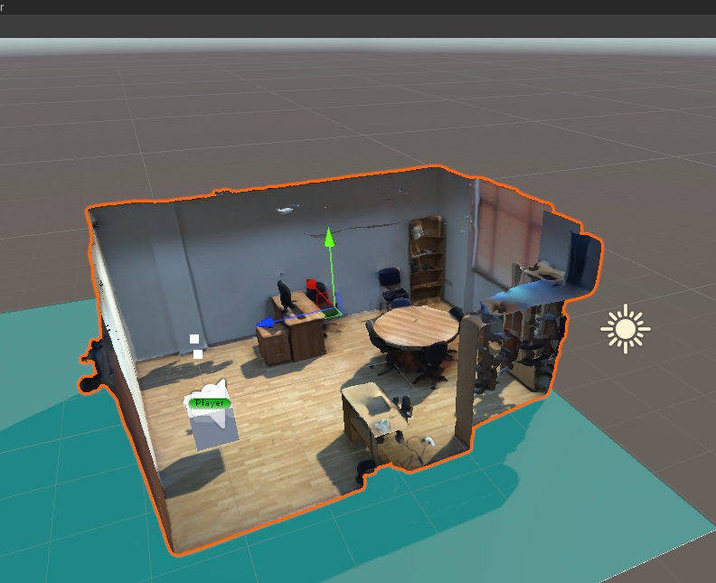

# VR-Lab-Scan
## Description 
A Virtual Reality reconstruction of the laboratory, used as a base environment for some cognitive experiments, to reduce the bias between real and virtual experience.

[[All my VR Projects here]](https://github.com/igor-lirussi?tab=repositories&q=virtual-reality)

### Topics:
- VR Virtual-Reality 
- 3D Scan

## Result

## Requirements & Dependencies
- Unity 2021.3
- Any Headset

## Install and Run
- Clone the repository
- Open with UnityHub
- Connect your device
- Run the app

## Useful Resources & Extra
- Notes
  - When adding the asset, if the cameras have been moved, the scan will not correspond to reality. It is faster to change the position in Unity of the Lab asset playing, testing real-time with the controllers the walls. Save the new coordinates and edit the project.
- Links
- Resources

## Authors
* **Igor Lirussi** @ BOUN Boğaziçi University - BuViar Lab

## Acknowledgments
*   All the people that contributed with suggestions and tips.

## License
This project is licensed - see the [LICENSE](LICENSE) file for details.
